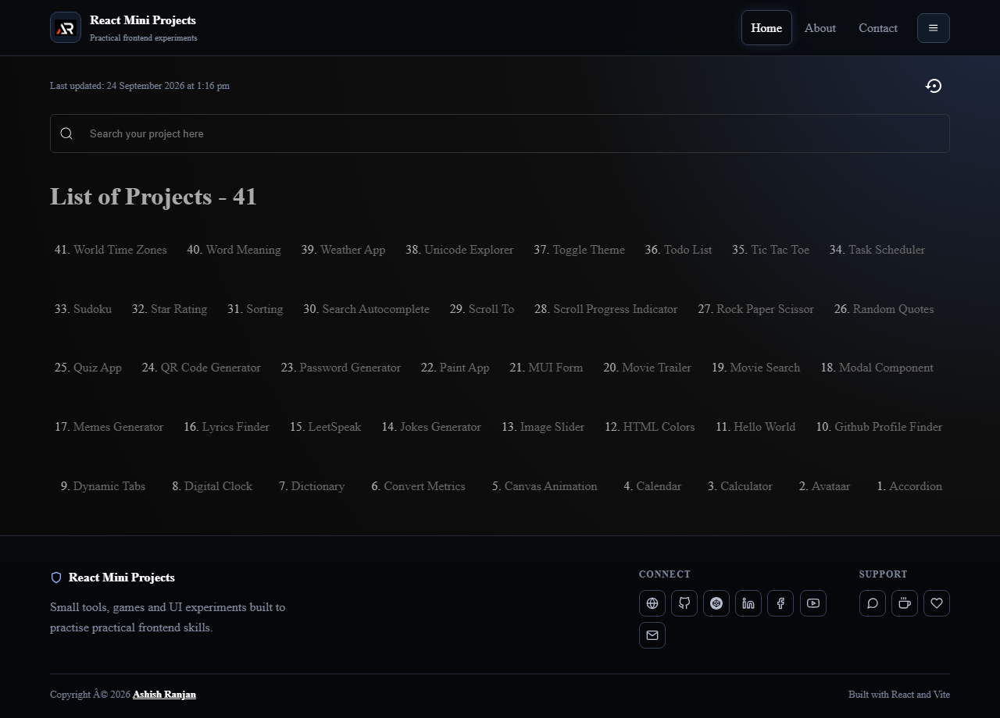

# React Daily Tools

A compact React and Vite collection of small frontend tools for everyday practice and quick experiments.

## Features

- Responsive tool dashboard with a fixed header and searchable slide-out menu
- Hello World route for checking the shared app shell
- Stopwatch with start, pause, reset and lap controls
- Simple border and shadow interactions with React Icons
- GitHub Pages deployment

## Tech stack

React, Vite, React Router, styled-components, Material UI and react-icons.

## Run locally

npm install
npm run dev

Build and preview:

npm run build
npm run preview

## Deployment

Live: https://a2rp.github.io/react-daily-tools/

## Links

- Portfolio: https://www.ashishranjan.net/
- GitHub: https://github.com/a2rp
- CodePen: https://codepen.io/ash1198
- LinkedIn: https://www.linkedin.com/in/aashishranjan
- Facebook: https://www.facebook.com/theash.ashish/
- YouTube: https://www.youtube.com/@ashishranjan-ashz?sub_confirmation=1
- Email: mailto:ash.ranjan09@gmail.com

## Support

- Support: https://a2rp-donation-page.netlify.app/
- Buy Me a Coffee: https://buymeacoffee.com/a2rp
- Patreon: https://patreon.com/a2rp
